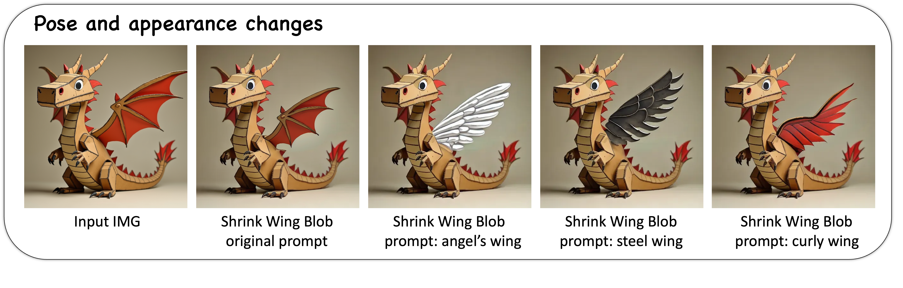
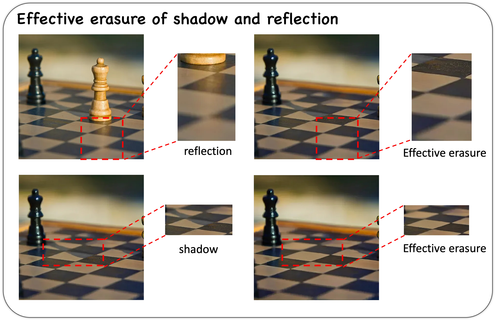
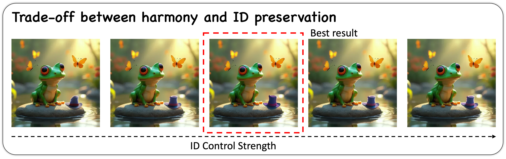
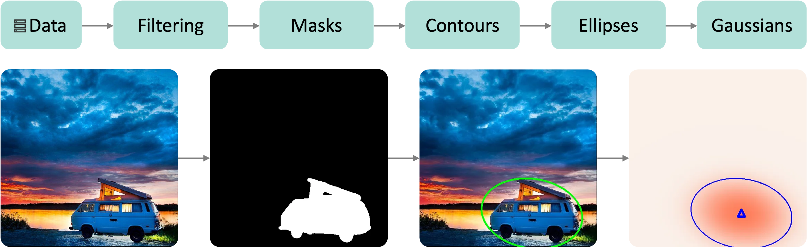
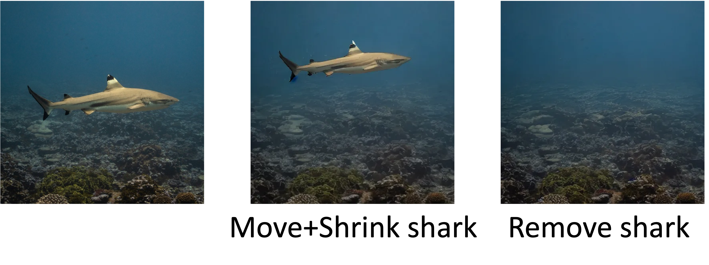

**1. Pose, appearance and texture variantion.**

**2. Rotate blob for object orientation.**

**3. Global effect removed.**

**4. Comparison with inpainting model BrsuNet.**

**5. Trade-off between harmony and ID preservation.**

**6. Overview of the BlobBench.**

**7. The BlobData curation workflow.**

**8. Representation Ability of Blob for Irregular Objects**

